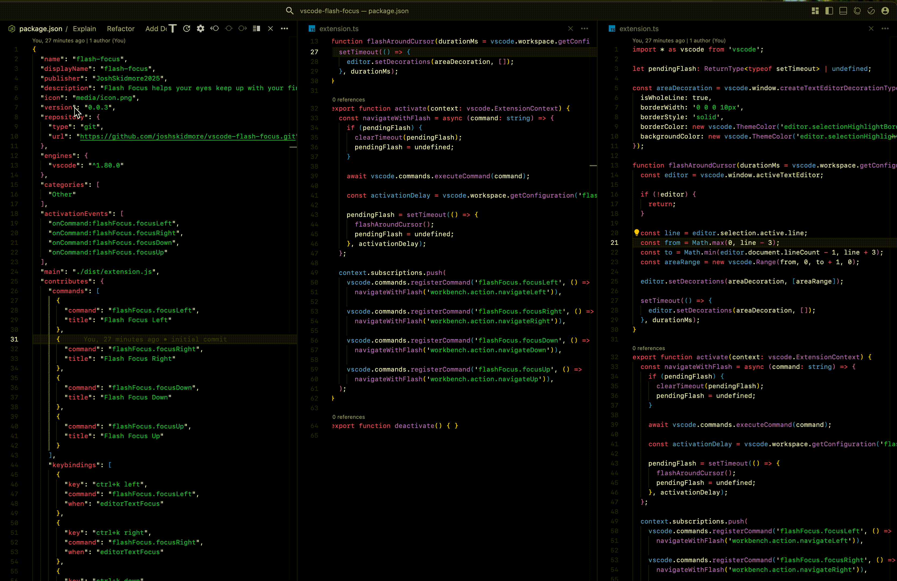

# Flash Focus

Flash Focus helps your eyes keep up with your fingers by highlighting the area around your cursor after navigating between editor groups in VS Code.

## Features

- Visually highlights the area around your cursor when navigating between editor groups
- Customizable flash duration and activation delay
- Smooth, non-intrusive visual feedback that helps maintain context when moving between editors
- Uses VS Code's native theme colors for consistent appearance

## Usage
Use the following keyboard shortcuts to navigate between editor groups with visual feedback:

- `Ctrl+K Left Arrow`: Navigate to the editor group on the left
- `Ctrl+K Right Arrow`: Navigate to the editor group on the right
- `Ctrl+K Down Arrow`: Navigate to the editor group below
- `Ctrl+K Up Arrow`: Navigate to the editor group above

## Extension Settings
This extension contributes the following settings:

* `flashFocus.duration`: How long (in ms) the flash highlight should stay visible (default: 600)
* `flashFocus.activationDelay`: Delay (in ms) before triggering the flash after navigation (default: 100)

## Why Flash Focus?
When working with multiple editor groups in VS Code, it's easy to lose track of where your cursor is, especially when rapidly switching between files. Flash Focus provides a subtle visual cue that helps your eyes catch up with your navigation, improving your workflow and reducing cognitive load.

## Release Notes
See the [CHANGELOG](CHANGELOG.md) for details on each release.

## License
MIT
